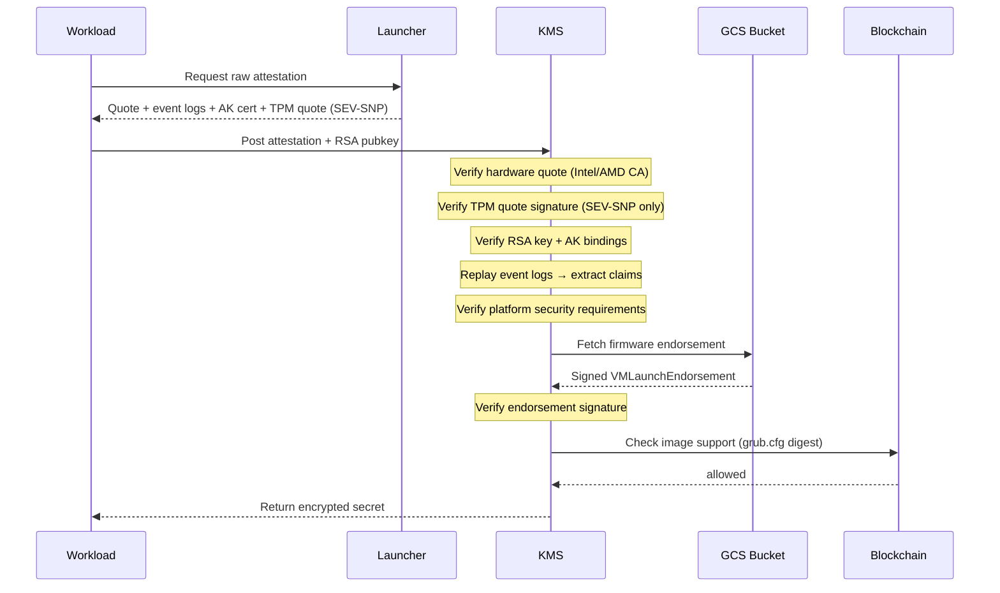

# Custom Confidential Space Images

## Problem

Out-of-the-box, Google Confidential Space (GCS) simplifies attestation by abstracting the complexity of multiple CVMs (e.g., TDX, SEV-SNP), acting as the verifier, and issuing a standard OIDC token. However, this convenience comes at the cost of flexibility. We are currently blocked on the Google roadmap for features like instance-level rate limiting, Docker Compose, and persistent disk encryption.

To obtain the necessary flexibility, we must modify the base image (Launcher + Container-Optimized OS). However, modifying the base image breaks compatibility with hosted attestation services (Google Cloud Attestation and Intel Trust Authority) because they validate against Google's Reference Integrity Measurements (RIM).

Attempting to use a custom image with GCA results in validation failure:
```
googleapi: Error 400: unable to validate with image RIMS: failed to get golden values:
kernel command line "..." is not in the golden values
```

Similarly, Intel Trust Authority (ITA) fails because its "Confidential Space Adapter" enforces a strict policy against Google's RIMs. We can use a custom ITA policy to allowlist our measurements, but this bypasses the adapter's parsing logic, meaning the resulting token lacks the rich container claims (args, env vars) found in standard Confidential Space tokens:
```
{"error":"claims policy apply failed ... GCPCS policy failed to meet requirements"}
```

## Proposed Solution

The proposed architecture consists of three parts:

1.  **Custom Base Images:** We customize the Confidential Space stack - modifying both the Launcher and the underlying Container-Optimized OS (COS) - while continuing to pull in upstream security patches and updates.
2.  **Self-Managed Allowlist:** We maintain a smart contract of valid custom image measurements, keyed by CVM platform (grub.cfg digest for both TDX and SEV-SNP).
3.  **Direct Verification:** The KMS (Relying Party) verifies the workload directly using **Raw Attestation** (TDX or SEV-SNP). The verification logic should be published as open-source libraries (Go initially) that any relying party can consume.

Instead of requesting a signed JWT from Google, the code running in the user workload queries a `/v1/raw-attestation` endpoint to retrieve the raw hardware quote, Canonical Event Log (container measurements), and AK certificates (platform identity). The workload then sends this evidence to the KMS, which performs verification before releasing any secrets:

1. Verify hardware quote signature (Intel CA for TDX, AMD CA for SEV-SNP).
2. Verify ReportData bindings (RSA key hash, AK public key hash).
3. Verify AK certificate chain against Google GCE EK root CA.
4. Replay event logs to extract platform state and container claims.
5. Verify platform meets security requirements (production mode, no debug, etc.).
6. Verify firmware (MRTD for TDX, MEASUREMENT for SEV-SNP) against Google's signed endorsements.
7. Verify OS image (grub.cfg digest) against on-chain allowlist.
8. Verify GCE project against policy and container digest against on-chain release registry.

### Measurement Validation

#### TDX Measurements

Each TDX measurement register is validated differently:

| Register | PCR Equivalent | What it measures | Validation |
|----------|----------------|------------------|------------|
| **MRTD** | - | Firmware binary (before boot) | Verify Google's signed endorsement from `gs://gce_tcb_integrity/ovmf_x64_csm/tdx/{MRTD}.binarypb` |
| **RTMR0** | PCR 1,7 | Secure Boot state | Extract from CCEL → verify Secure Boot enabled |
| **RTMR1** | PCR 2-6 | EFI state (boot order, UEFI apps) | Not used for allowlist |
| **RTMR2** | PCR 8-15 | GRUB + kernel + container events | Replay CEL → container claims |

**Important:** RTMR1 does NOT contain the kernel or launcher - those are in RTMR2. The base image allowlist uses **PCR 8 + PCR 9** from the vTPM:

| PCR | What it measures | Used for |
|-----|------------------|----------|
| **PCR 8** | Kernel command line (includes dm-verity root hash) | Launcher identity |
| **PCR 9** | Files read by GRUB (kernel, initramfs) | Base image identity |

**Why PCR 8 captures launcher changes:**
```
Launcher code change → OEM partition changes → seal-oem recomputes dm-verity hash
→ dm-verity hash embedded in kernel cmdline → measured to PCR 8
```

**Note:** PCR values come from the vTPM and are **platform-agnostic** - the same values for TDX and SEV-SNP when running identical images. This means you only need to add one entry to the allowlist per image.

#### SEV-SNP Measurements

SEV-SNP uses a hybrid approach: the SNP report provides firmware measurements, while the TPM event log provides OS and container measurements:

| Field | What it measures | Validation |
|-------|------------------|------------|
| **MEASUREMENT** | Firmware binary | Verify Google's signed endorsement from `gs://gce_tcb_integrity/ovmf_x64_csm/sevsnp/{MEASUREMENT}.binarypb` |
| **PCR 8 + PCR 9** | Launcher + base image | On-chain allowlist (same values as TDX) |
| **CEL** | Container events | Replay CEL to extract claims (verified via TPM quote signed by AK) |

**Platform-agnostic measurements:**
- **PCR 8** (kernel cmdline) and **PCR 9** (GRUB files) are identical for TDX and SEV-SNP running the same image
- Only one allowlist entry needed per image version
- **CEL events** extracted from TPM event log for container claims

The AK public key is cryptographically bound to the hardware quote (via ReportData), ensuring the GCE claims and the Container claims belong to the same physical entity.

#### TCB Version Enforcement

The contract enforces minimum TCB (Trusted Computing Base) versions per platform. This allows rejecting attestations from hosts running outdated firmware or microcode with known vulnerabilities.

| Platform | TCB Field | Format |
|----------|-----------|--------|
| **TDX** | `TeeTcbSvn[0:3]` | Packed as `(major << 16 \| minor << 8 \| microcode)` |
| **SEV-SNP** | `CurrentTcb` | uint64 with packed component versions (bootloader, TEE, SNP, microcode) |

**Important:** On GCP, you cannot force a TCB update - Google rolls out firmware and microcode updates on their schedule. Setting a minimum TCB version in the contract allows you to refuse secrets to unpatched hosts until Google updates them. This is expected to be rarely used, but provides a policy lever for responding to critical vulnerabilities.

To update the minimum TCB:
```bash
# TDX (CVM=0): For TDX Module 1.5.x with microcode SVN 2
cast send $CONTRACT 'setMinimumTcb(uint8,uint64)' 0 0x010502 --private-key $PRIVATE_KEY

# SEV-SNP (CVM=1): Use CurrentTcb value from a known-good attestation
cast send $CONTRACT 'setMinimumTcb(uint8,uint64)' 1 0x... --private-key $PRIVATE_KEY
```

### Firmware Endorsement Verification

Firmware measurement validation uses Google's signed endorsements:

1. **Lookup**: Convert the 48-byte measurement to hex and fetch from:
   - TDX: `gs://gce_tcb_integrity/ovmf_x64_csm/tdx/{MRTD_HEX}.binarypb`
   - SEV-SNP: `gs://gce_tcb_integrity/ovmf_x64_csm/sevsnp/{MEASUREMENT_HEX}.binarypb`
2. **Parse**: Unmarshal the `VMLaunchEndorsement` protobuf containing:
   - `serialized_uefi_golden`: The `VMGoldenMeasurement` with measurement values for different configurations
   - `signature`: RSA-PSS signature over `serialized_uefi_golden`
3. **Verify Signature**: Validate the signature chain against Google's TCB root certificate (`https://pki.goog/cloud_integrity/GCE-cc-tcb-root_1.crt`)
4. **Extract Metadata**: The endorsement provides SVN (Security Version Number), build timestamp, and changelist for audit purposes

### Parity with Managed Attestation

By verifying the raw attestation evidence directly, we rely on the same cryptographic roots of trust as the managed services:

- **Hardware Root of Trust:** The **TDX Quote** (Intel CA) or **SEV-SNP Report** (AMD CA) proves the integrity of the hardware and firmware measurements.
- **Platform Root of Trust:** The **AK Certificate** is signed by Google's GCE EK root CA, proving the instance is a genuine GCE VM and providing claims like Project ID, Zone, and Instance ID.
- **Firmware Root of Trust:** The **Firmware Endorsement** is signed by Google's TCB root CA, proving the firmware is a genuine Google-built UEFI binary.
- **Binding:** The AK public key is cryptographically bound to the hardware quote (via ReportData), ensuring the GCE claims and the Container claims belong to the same physical entity.

This allows the Relying Party to validate the same hardware, platform, and workload identity signals required for policy enforcement.

### Runtime Attestations

Since we verify raw quotes directly rather than relying on hosted attestation services, we are no longer bound by Google or Intel Trust Authority rate limits. This enables runtime attestations - verifying quotes on-demand during operation, not just at startup.

## Responsibility Shift

This approach fundamentally changes the trust model. Previously, Google determined trustworthiness via their RIM database. Now, **we** determine trustworthiness via our allowlist (for custom images) while still relying on Google's cryptographic endorsements for firmware.

We gain full control over the software stack but inherit additional maintenance responsibilities:
- **Build & Patch:** We must build and patch the base image rather than relying on Google updates (although we can incorporate patches as they appear in the upstream codebase).
- **Allowlist Management:** We must maintain the database of valid custom image measurements (PCR 8 + PCR 9 from vTPM, platform-agnostic for TDX and SEV-SNP).
- **Verification Logic:** Instead of simply checking a Google JWT signature, we must implement and maintain the full TDX/SEV-SNP verification protocols (checking Intel/AMD/Google root CAs, replaying event logs, verifying TPM quotes, verifying firmware endorsements, etc).

## Demo

The following demo implements end-to-end verification where a KMS verifies raw attestations using Google's firmware endorsements and an on-chain image allowlist.



### Running the Demo

Requires the `data-axiom-440223-j1` GCP project.

#### Quick Start

Use the pre-built custom image `confidential-space-debug-cavan-test-image-1765405118` which is already registered in the deployed allowlist.

```bash
# Setup configuration
cp research/config.env.example research/config.env

# Edit config.env to set DOCKER_REPO to a Docker repository you control
# (e.g., docker.io/yourusername)

# Run the demo
./research/scripts/run.sh
```

#### Building Your Own Image

If you modify the source code to build your own custom image (different from the provided one), you must deploy your own allowlist contract and register the new measurements.

```bash
# Deploy contract
export PRIVATE_KEY="0x..."
./research/scripts/setup.sh deploy

# Add your custom image (PCR 8 + PCR 9 from vTPM, platform-agnostic)
./research/scripts/setup.sh add-image --pcr8 0x<pcr8_hex> --pcr9 0x<pcr9_hex> --level LATEST

# Run the demo
./research/scripts/run.sh
```

**Note:** Firmware verification (MRTD for TDX, MEASUREMENT for SEV-SNP) is automatic via Google's signed endorsements from GCS.

### Proof of Concept Implementation

These files are a rough demonstration to illustrate the architecture:

- `launcher/agent/agent.go`: `GetRawAttestation()` implementation for TDX and SEV-SNP.
- `research/kms/verifier_tdx.go`: TDX quote verification (Intel/Google root CAs).
- `research/kms/verifier_sevsnp.go`: SEV-SNP report verification (AMD/Google root CAs).
- `research/kms/firmware.go`: Firmware verification for TDX (MRTD) and SEV-SNP (MEASUREMENT).
- `research/contracts/src/BaseImageAllowlist.sol`: Smart contract for custom image allowlist.
- `research/workload/main.go`: Sample workload with platform auto-detection.

### Supported Platforms

| Platform | Machine Type | KMS Endpoint | Status |
|----------|-------------|--------------|--------|
| **TDX** | c3-standard, c3d-standard | `/v1/attest/tdx` | Implemented |
| **SEV-SNP** | n2d-custom-2-1024 | `/v1/attest/sevsnp` | Implemented |

The workload automatically detects the platform based on the attestation response and uses the appropriate KMS endpoint.

### Building Custom Images

We can modify the Launcher code directly. For deeper OS-level customizations, we use Google's [COS Customizer](https://cos.googlesource.com/cos/tools). This tool simplifies tasks like installing GPU drivers, sealing the OEM partition (`dm-verity`), and disabling auto-updates to ensure measurement stability.
