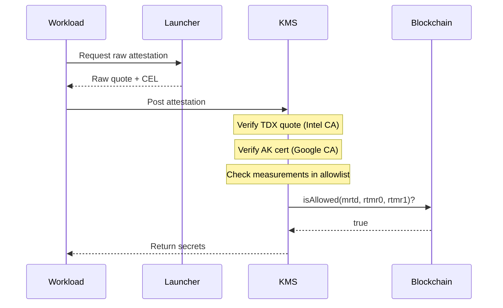

# Custom Confidential Space Images

## Problem

Out-of-the-box, Google Confidential Space (GCS) simplifies attestation by abstracting the complexity of multiple CVMs (e.g., TDX, SEV-SNP), acting as the verifier, and issuing a standard OIDC token. However, this convenience comes at the cost of flexibility. We are currently blocked on the Google roadmap for features like instance-level rate limiting, Docker Compose, and persistent disk encryption.

To obtain the necessary flexibility, we must modify the base image (Launcher + Container-Optimized OS). However, modifying the base image breaks compatibility with hosted attestation services (Google Cloud Attestation and Intel Trust Authority) because they validate against Google's Reference Integrity Measurements (RIM).

Attempting to use a custom image with GCA results in validation failure:
```
googleapi: Error 400: unable to validate with image RIMS: failed to get golden values:
kernel command line "..." is not in the golden values
```

Similarly with ITA:
```
{"error":"claims policy apply failed ... GCPCS policy failed to meet requirements"}
```

## Proposed Solution

The proposed architecture consists of three parts:

1.  **Custom Base Images:** We customize the Confidential Space stack—modifying both the Launcher and the underlying Container-Optimized OS (COS)—while continuing to pull in upstream security patches and updates.
2.  **Self-Managed Allowlist:** We maintain a smart contract of valid measurements for these images.
3.  **Direct Verification:** The KMS (Relying Party) verifies the workload directly using **Raw TDX Attestation**.

Instead of requesting a signed JWT from Google, the code running in the user workload queries the `/v1/raw-attestation` endpoint to retrieve the raw TDX quote, Canonical Event Log (CEL), and AK certificates. The workload then sends this evidence to the KMS, which performs verification before releasing any secrets:

1. Verify the TDX quote against Intel's root CA.
2. Verify the AK certificate against Google's GCE EK root CA.
3. Replay the CEL to extract container measurements.
4. Validate these measurements against our allowlist.

### Parity with Managed Attestation

By verifying the raw attestation evidence directly, we maintain the same trust guarantees as the managed services:

- **Hardware Root of Trust:** The **TDX Quote** is signed by Intel's root CA, proving the integrity of the hardware and the base image measurements (MRTD, RTMRs).
- **Platform Root of Trust:** The **AK Certificate** is signed by Google's GCE EK root CA, proving the instance is a genuine GCE VM and providing claims like Project ID, Zone, and Instance ID.
- **Binding:** The AK public key is cryptographically bound to the TDX quote (via ReportData), ensuring the GCE claims and the Container claims (reconstructed from the Event Log) belong to the same physical entity.

This allows the Relying Party to validate the same hardware, platform, and workload identity signals required for policy enforcement.

## Responsibility Shift

This approach fundamentally changes the trust model. Previously, Google determined trustworthiness via their RIM database. Now, **we** determine trustworthiness via our allowlist.

We gain full control over the software stack but inherit significant maintenance responsibilities:
- **Build & Patch:** We must build and patch the base image rather than relying on Google updates (although we can incorporate patches as they appear in the upstream codebase).
- **Allowlist Management:** We must maintain the database of valid image measurements.
- **Verification Logic:** Instead of simply checking a Google JWT signature, we must implement and maintain the full TDX verification protocol (checking Intel/Google root CAs, replaying event logs, etc).

## Demo

The following demo implements end-to-end verification where a KMS verifies raw attestations against an on-chain allowlist.



### Running the Demo

Requires the `data-axiom-440223-j1` GCP project.

#### Quick Start

Use the pre-built custom image `confidential-space-debug-cavan-test-image-1764789757` which is already registered in the deployed allowlist.

```bash
# Setup configuration
cp research/config.env.example research/config.env

# Run the demo
./research/scripts/run.sh
```

#### Building Your Own Image

If you modify the source code to build your own custom image (different from the provided one), you must deploy your own allowlist contract and register the new measurements.

```bash
# Deploy contract
export PRIVATE_KEY="0x..."
./research/scripts/setup.sh deploy --rpc-url https://sepolia.infura.io/v3/YOUR_KEY

# Add base image measurements
./research/scripts/setup.sh add-image --mrtd 0x... --rtmr0 0x... --rtmr1 0x...

# Run the demo
./research/scripts/run.sh
```

### Proof of Concept Implementation

These files are a rough demonstration to illustrate the architecture:

- `launcher/agent/agent.go`: `GetRawAttestation()` implementation.
- `research/kms/verifier.go`: Verification logic (handling Intel and Google root CAs).
- `research/contracts/src/BaseImageAllowlist.sol`: Smart contract replacing the RIM database.

### Building Custom Images

We can modify the Launcher code directly. For deeper OS-level customizations, we use Google's [COS Customizer](https://cos.googlesource.com/cos/tools). This tool simplifies tasks like installing GPU drivers, sealing the OEM partition (`dm-verity`), and disabling auto-updates to ensure measurement stability.
